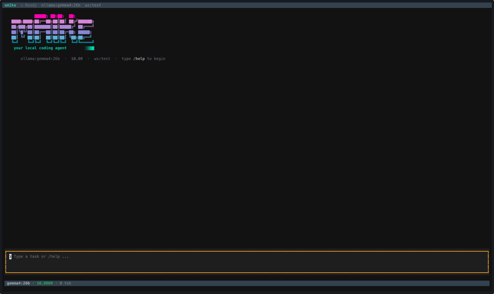

<h1 align="center">mAIke</h1>

<p align="center">
  <a href="LICENSE"></a>
  <a href="https://www.python.org"></a>
  
  
</p>

<p align="center"><b>A ReAct coding agent with strict tool gating, pre-call cost projection, and persistent project memory.</b></p>

<p align="center">Runs Claude, GPT, Gemini, or a local Ollama model. Sessions, cost ledger, and project memory stay on your machine. Hosted-provider API calls send your code to that provider — only Ollama keeps it fully local.</p>

<p align="center">
  
</p>

---

## What this is

mAIke is a personal research and learning project — an end-to-end coding agent built to explore specific design questions: pre-call cost projection, risk-tiered tool gating, persistent auto-memory, multi-provider routing, and what a cheap-executor + frontier-advisor pairing can or can't do.

It is **not** trying to compete with Claude Code, Aider, OpenHands, or Devin. The repo is open so the design and the in-progress eval data can be inspected, discussed, copied, and argued with. If something here is useful in your own work, take it.

## Design

mAIke explores three ideas: every API call should be priced *before* it fires (not reconciled after); every tool that mutates state should pass through an explicit risk gate before it runs; and the project knowledge an agent earns in one session should carry into the next without re-exploration. The agent process runs on your machine and treats provider choice as a per-session decision; with Ollama, the entire loop stays on-device. Everything else — sub-agents, the eval harness — falls out of those questions.

### Features

- **Multi-provider** — Anthropic, OpenAI, Gemini (direct API or Vertex), and any Ollama model. Configured per session via `--provider` / `--model`.
- **Pre-call cost projection** — every API call is priced *before* it fires. Sessions abort gracefully at 95% of your budget instead of blowing past it.
- **Tool risk gating** — every tool is tiered `READ → WRITE → EXECUTE → DESTRUCTIVE`. Writes need a git checkpoint; execution needs inline approval.
- **Read-before-edit enforcement** — the Edit tool refuses to run on a file the agent hasn't Read this turn, killing a whole class of cascading edit bugs.
- **Auto-memory** — at session end, mAIke distills project overview / key decisions / resolved pitfalls into `.maike/memories/`. The next session starts with that knowledge already in context.
- **Async sub-agents** — spawn read-only delegates that run in parallel; the main agent collects results with `Delegate(action="check"|"wait")`.
- **SWE-bench built in** — `maike swe-bench --variant lite|verified|full` runs on real instances with clone caching and resume support.
- **Threads & worktrees** — multiple concurrent conversations per workspace, isolated git worktrees for branch work.
- **Extensible** — Skills, Plugins, MCP servers, and LSP language servers as first-class surfaces.

## SWE-bench Verified — early signal

Early in-progress eval data, not a leaderboard claim. Cold-start eval against [SWE-bench Verified](https://www.swebench.com/verified.html) using the official Docker harness running hidden `FAIL_TO_PASS` tests. **Stratified 48-instance subset** of the 500-instance benchmark (April 2026, models: `gemini-3.1-pro-preview`, `gemini-3.1-flash-lite-preview`).

| Configuration | Resolved on subset | Total cost |
|---|---|---|
| Gemini 3.1 Pro alone | 25/48 (52.1%) | $62.93 |
| Gemini 3.1 Flash Lite alone | 9/48 (18.8%) | $8.25 |

### By difficulty bucket

| Bucket | n | Pro | Flash Lite |
|---|---|---|---|
| Easy: `<15min` + `15min–1h` | 36 | 24/36 (66.7%) | 9/36 (25.0%) |
| Hard-tail: `1–4h` + `>4h` | 12 | 1/12 (8.3%) | 0/12 (0%) |

Hard-tail instances make up `25%` of this subset but only `~9%` of full Verified, so the subset is biased toward harder cases.

### What these numbers are and aren't

- **They are**: a directional, in-progress signal that the agent + harness produce real (cold-start, FAIL_TO_PASS-verified) fixes on a stratified 48-instance subset.
- **They are not**: a SWE-bench Verified leaderboard score. A full 500-instance run is on the roadmap; until then, treat as early data.
- **mAIke is alpha**, single-engineer development. Behaviour, costs, and surface area are still moving.
- **Numbers are mAIke alone.** The advisor pairing mode (see below) has a known regression and is excluded from this run.

### Reproduce

```bash
# Generate predictions
maike swe-bench --variant verified \
  --provider gemini --model gemini-3.1-pro-preview \
  --budget 5.0 --timeout 1800 \
  --output predictions.jsonl

# Score with the official SWE-bench Docker harness
python -m swebench.harness.run_evaluation \
  --predictions_path predictions.jsonl \
  --dataset_name SWE-bench/SWE-bench_Verified \
  --run_id maike-pro-verified
```

## Status

This is a personal research project, not a product. The CLI is stable enough for me to use day-to-day; it is not designed for long-term API stability and will change as I poke at the design questions above. Issues, PRs, and disagreement-with-receipts are all welcome — see [CONTRIBUTING.md](CONTRIBUTING.md) before non-trivial PRs.

## Table of Contents

- [Quick Start](#quick-start)
- [Providers & Models](#providers--models)
- [Interactive Mode](#interactive-mode)
- [One-shot & Scripted Runs](#one-shot--scripted-runs)
- [Cost & Budgets](#cost--budgets)
- [Tool Safety Model](#tool-safety-model)
- [Auto-Memory](#auto-memory)
- [Threads & Worktrees](#threads--worktrees)
- [Advisor](#advisor)
- [Sub-Agents & Delegation](#sub-agents--delegation)
- [Extensibility](#extensibility)
- [Evaluation](#evaluation)
- [Configuration](#configuration)
- [Architecture](#architecture)
- [CLI Reference](#cli-reference)

---

## Quick Start

```bash
# Python 3.11+
git clone https://github.com/lkshay/mAIke-oss.git
cd mAIke-oss
pip install -e .

# Set keys interactively (writes ~/.config/maike/.env)
maike setup

# Or export directly
export GEMINI_API_KEY="..."        # ANTHROPIC_API_KEY / OPENAI_API_KEY / GOOGLE_API_KEY also accepted
# Ollama? Just `ollama serve` — no key needed.

# One-time per workspace — generates MAIKE.md (project context + protected files)
maike init

# Launch the TUI
maike
```

---

## Providers & Models

| Provider | Auth | Notes |
|----------|------|-------|
| **Anthropic** | `ANTHROPIC_API_KEY` | Claude family |
| **OpenAI** | `OPENAI_API_KEY` | GPT family |
| **Gemini (direct)** | `GEMINI_API_KEY` or `GOOGLE_API_KEY` | Native thought-signature support, 1M context |
| **Gemini (Vertex)** | `gcloud auth application-default login` + `GOOGLE_GENAI_USE_VERTEXAI=True` | No API key needed |
| **Ollama (local)** | none | Set `OLLAMA_HOST` for remote daemons. Zero pricing. |

Default model and pricing live in `maike/constants.py` and `maike/models_default.yaml`. Override per-session with `--provider` / `--model`, or persist to `~/.config/maike/models.yaml` (deep-merged with defaults).

```bash
maike --provider gemini --model gemini-3.1-flash-lite-preview
maike --provider anthropic --model claude-opus-4-20250514
maike --provider ollama --model gemma4:26b
```

---

## Interactive Mode

`maike` on its own opens the Textual-based TUI in the current directory.

```bash
maike                                       # defaults
maike --provider gemini --budget 5.00       # override provider + budget
maike --yes --verbose                       # auto-approve + inline traces
```

| Flag | Purpose |
|------|---------|
| `--provider` | `anthropic` / `openai` / `gemini` / `ollama` |
| `--model` / `-m` | Override the provider default |
| `--budget` / `-b` | Session budget in USD (default 5.00) |
| `--yes` / `-y` | Auto-approve tool calls |
| `--verbose` / `-v` | Stream LLM and tool traces inline |
| `--new-thread` | Force a brand-new thread |
| `--thread <id>` | Continue a specific thread |

**Inside the TUI**

- Streamed output with collapsible tool-call widgets
- `@`-mention to attach files or directories
- Inline approval widgets — APPROVE / APPROVE_ALWAYS / DENY, with optional typed reason
- Ctrl+C copies selection (or quits when nothing is selected)

**Slash commands**

| Command | Purpose |
|---------|---------|
| `/help` | Show help and keybindings |
| `/cost` | Session cost and tokens |
| `/status` | Provider, model, budget, workspace |
| `/new` | Start a new conversation thread |
| `/clear` | Clear the screen |
| `/agent`, `/create-agent` | List / create custom agents |
| `/team`, `/create-team` | List / create agent teams |
| `/skill` | List, load, or install skills |
| `/plugin` | List / install / enable / disable plugins |
| `/worktree` | Manage git worktrees |
| `/quit` | Exit (aliases: `/exit`, `/q`) |

---

## One-shot & Scripted Runs

For CI, automation, or `cron` jobs:

```bash
maike run "Add input validation to the User model"
maike run "Fix failing tests" --provider gemini --budget 2.00 --yes
maike resume <session-id> --workspace <path>
```

`maike run` is non-interactive — the agent runs to completion (or budget exhaustion) and exits with a status code.

---

## Cost & Budgets

mAIke prices every call **before firing it**. Two enforcement layers:

- **`CostTracker`** (session-level) — runs `check_projected_session_budget()` against the next call's expected cost. If the projection would push the session past 95% of budget, the call is blocked and the session terminates gracefully.
- **`BudgetEnforcer`** (per-agent) — sub-agents and delegates have their own caps so a runaway delegate can't drain the parent's budget.

```bash
maike --budget 5.00                  # USD per session
maike cost                           # last/current session breakdown
maike cost <session-id>              # specific session
maike history                        # workspace session history
```

Sessions persist a structured cost ledger in `.maike/` for later analysis.

---

## Tool Safety Model

Every built-in tool carries a `RiskLevel`. The `SafetyLayer` intercepts every tool call and gates it:

| Level | Examples | Gate |
|-------|----------|------|
| **READ** | `Read`, `Grep`, `SemanticSearch`, `WebSearch`, `WebFetch` | runs freely; READ-safe tools execute in parallel |
| **WRITE** | `Write`, `Edit` | requires a git checkpoint |
| **EXECUTE** | `Bash` | requires checkpoint + inline approval (skipped with `--yes`) |
| **DESTRUCTIVE** | `rm -rf`, drop-table style | always prompts; pattern-matched in `safety/rules.py` |

**Read-before-edit:** the Edit tool refuses to run on a file the agent hasn't Read in this turn. The bug class this prevents: an agent reads a file, edits it, then issues a second edit based on its stale recollection of the original contents — silently corrupting the second edit because the line numbers, surrounding context, or assumed state no longer match. After every successful edit the read state clears, forcing a fresh read before the next edit on that file.

**Bash idle timeout:** commands are killed if they produce no output for `idle_timeout` seconds (floor 10s). Errors include actionable recovery hints (`use timeout_class="long"` or `background=true`).

---

## Auto-Memory

At session end, mAIke distills durable project knowledge into Markdown files under `<workspace>/.maike/memories/`. The distillation is synchronous and deterministic — no LLM call, no async work — which means it survives TUI cancellation, network failure, and budget exhaustion. Three memory types:

- **`project_overview.md`** — purpose, tech stack, key modules. Extracted from the session's tool-call history (which files were read, which commands ran, what the test framework is).
- **`key_decisions.md`** — architectural choices the agent made or surfaced from the codebase, parsed from the agent's own milestone messages.
- **`pitfalls.md`** — errors encountered and the fix that resolved them, captured from the `RepeatedFailureTracker`'s 13-category error classifier.

Each memory is a Markdown file with YAML frontmatter (`name`, `description`, `type`, `created_at`). On collision, a counter is appended rather than overwriting — older memories are preserved verbatim. A `MEMORY.md` index file lists all entries with their descriptions for quick scanning.

The next session reads `MEMORY.md` plus the topic files at startup (capped at 8K tokens total, 2K per file) and injects them as a `<maike-memory priority="high" source="auto-memory">` context block before the first user message. The result: no re-exploration of the same files, no re-discovery of the same pitfalls, no repeated wrong turns across sessions.

---

## Threads & Worktrees

A workspace can hold many concurrent **threads** — each keeps its own message history, plan, and cost ledger.

```bash
maike threads                    # list threads
maike --thread <id>              # continue a specific thread
maike --new-thread               # force a brand-new thread
```

For isolated branch work, `maike worktree add/list/remove` wraps `git worktree` so an agent can operate on a side branch without touching your main checkout.

---

## Advisor (alpha — known regression)

> ⚠️ **Status: not currently working.** The advisor pairing mode has a runaway-trace regression that emits multi-GB of trace events on stuck loops in some configurations. The eval results above were run *without* the advisor. Treat this section as a description of the intended design, not a working feature, until the regression is fixed.

The intended design: pair a cheap fast executor (e.g. Gemini 3.1 Flash Lite) with a frontier-model **advisor** that fires only at decisive moments — long exploration, repeated failures, before the first edit, before completion.

```bash
# Same-provider pairing (matches the eval above)
maike --provider gemini --model gemini-3.1-flash-lite-preview \
      --advisor --advisor-provider gemini --advisor-model gemini-3.1-pro-preview \
      --advisor-budget-pct 0.2

# Cross-provider pairing also works
maike --provider gemini --model gemini-3.1-flash-lite-preview \
      --advisor --advisor-provider anthropic --advisor-model claude-opus-4-20250514
```

The advisor never runs tools. It returns 1–3 sentences of guidance that mAIke injects into the executor's next turn as a `<maike-advisor>` context block. It has its own budget cap (default 20% of session). Trigger conditions live in `maike/agents/advisor.py`.

---

## Sub-Agents & Delegation

The `Delegate` tool spawns read-only sub-agents in the background.

```python
# Inside an agent's tool call (illustrative)
Delegate(
    task="Find all callers of `parse_config`",
    agent_type="explore",      # explore | plan | verify | review | debug | implement | test
    background=True,           # default — returns a handle
)
# Later:
Delegate(action="check", handle="...")
Delegate(action="wait", handle="...")
```

- **Tool profiles** scope what each delegate type can do — `explore` gets `Read`/`Grep`/`SemanticSearch`/read-only `Bash`; `debug` adds `Edit`; `implement`/`test` get everything.
- **Result delivery** is inline (up to 3000 chars) — not file pointers — and persisted as `agent_runs` in the session DB.
- **Auto-resume** waits for *all* running delegates to complete before injecting results in one batch — preventing the parent from re-spawning delegates for already-covered work.
- `MAX_ASYNC_DELEGATES = 5`. The error message guides the LLM to use `action="wait"` if hit.

**Quality validation:** `assess_delegate_quality()` checks delegate outputs. Zero-tool-call delegates auto-retry once with a nudge. Quality flags (`good`/`suspect`/`hallucinated`) appear in notifications.

---

## Extensibility

| Surface | What it gives you | Install |
|---------|-------------------|---------|
| **Skills** | Reusable Markdown procedures the agent invokes on demand | `maike skill install <path-or-url>` |
| **Plugins** | Bundles of skills, agents, hooks, MCP and LSP configs | `maike plugin install <path-or-url>` |
| **MCP** | Any Model Context Protocol server appears as a first-class tool | `.mcp.json` |
| **LSP** | Language servers feed diagnostics and symbols into context | declared in plugin manifest |
| **Custom agents / teams** | Build via `/create-agent` and `/create-team` interactively | TUI |

---

## Evaluation

Built-in agentic test cases — seeders inject bugs into a workspace, verifiers run the project's tests, and per-feature outcomes are scored.

```bash
maike eval --suite all
maike eval --suite hard-agentic --keep-workspaces
```

The `agentic_eval_score()` weights: workspace verified (35%) · session completed (25%) · tests passing (15%) · error recovery (10%) · change minimality (10%) · wasted-call efficiency (5%).

For SWE-bench, see [SWE-bench Verified](#swe-bench-verified) for results and the reproduction recipe; the [CLI Reference](#cli-reference) lists every `maike swe-bench` flag.

---

## Configuration

### Environment Variables

| Variable | Purpose |
|----------|---------|
| `ANTHROPIC_API_KEY` / `OPENAI_API_KEY` / `GEMINI_API_KEY` (or `GOOGLE_API_KEY`) | Provider keys |
| `GOOGLE_GENAI_USE_VERTEXAI=True` + `GOOGLE_CLOUD_PROJECT` + `GOOGLE_CLOUD_LOCATION` | Use Gemini via Vertex AI |
| `OLLAMA_HOST` | Override the local Ollama endpoint |
| `BRAVE_SEARCH_API_KEY` / `GOOGLE_SEARCH_API_KEY` + `GOOGLE_SEARCH_ENGINE_ID` | Web search backends |
| `MAIKE_DEFAULT_BUDGET_USD` | Default session budget (default 5.00) |
| `MAIKE_WORKSPACE` | Default workspace path |
| `MAIKE_LOG_LEVEL` | Logging level |

### MAIKE.md

`maike init` writes a per-workspace `MAIKE.md` with:

- Project context (auto-detected language, build commands, test commands)
- A `## Protected Files` section — files matching these patterns cannot be modified by the agent (post-hoc enforcement in `agents/core.py`)

MAIKE.md is yours to edit — mAIke reads it but never writes to it.

---

## Architecture

```
CLI → Orchestrator → AgentCore (ReAct loop)
                       ├─ LLMGateway      provider adapters · retry · adaptive routing
                       ├─ ToolRegistry    Read · Write · Edit · Bash · Grep · …
                       ├─ SafetyLayer     risk-tier gating · checkpoint gates
                       ├─ CostTracker     pre-call projection · 95% cutoff
                       └─ Memory          SQLite session store · ChromaDB long-term
```

See [docs/ARCHITECTURE.md](docs/ARCHITECTURE.md) for the design decisions behind each component.

---

## CLI Reference

```bash
maike                                            # interactive TUI
maike setup                                      # write API keys to ~/.config/maike/.env
maike init                                       # generate MAIKE.md for the current workspace
maike run <task> [--provider --model --budget --yes]   # one-shot non-interactive
maike resume <session-id> --workspace <path>     # resume a specific session
maike threads                                    # list threads in this workspace
maike cost [<session-id>]                        # cost breakdown
maike history                                    # workspace session history
maike eval --suite <all|agentic|hard-agentic|live-repo> [--keep-workspaces]
maike swe-bench --variant <lite|verified|full> [--instance-ids ... | --resume FILE]
maike worktree <add|list|remove> ...             # git worktree management
maike skill <install|list|remove>
maike plugin <install|list|remove>
```

---

## License

[Apache 2.0](LICENSE) — see the LICENSE file for the full text.
